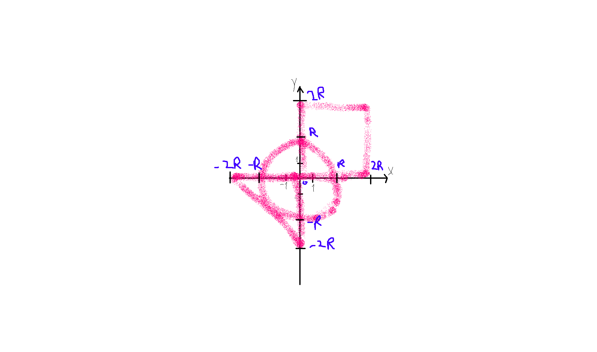

# Web Lab 1


## Tags for HRs

`java`, `jakarta`, `junit`, `mongodb`, `docker`, `docker compose`, `svelte`, `node`, `typescript`

## Run

```bash
sudo make docker-dev
```

## My Masterpiece of Art


